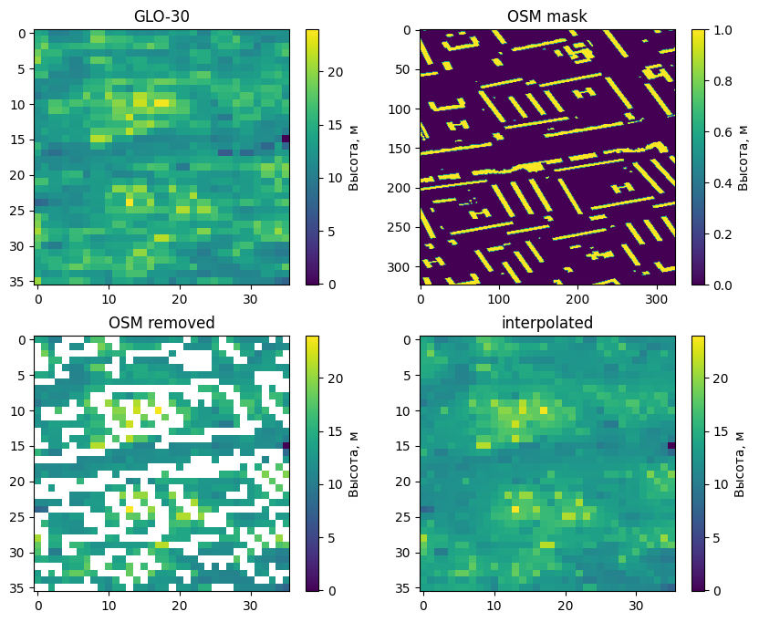
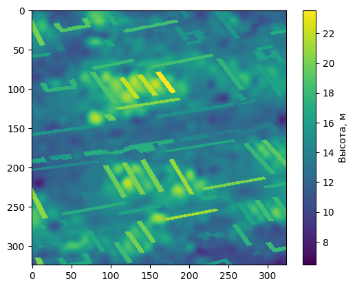
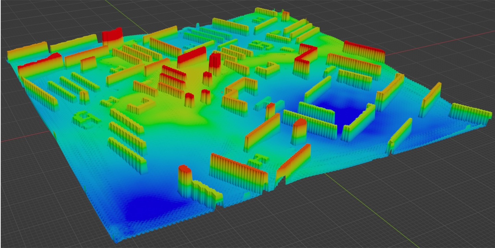

# City-DEM-Superresolution

В этом репозитории представлен исходный код и текст моей магистерской ВКР на тему "Разработка алгоритма генерации ландшафта по неполным данным для увеличения разрешения карт высот городской застройки"

Разработанный метод увеличения картвысот городской засртойки заключает в удалении зданий с карт высот, последующей интерполяции удалённых точек, увеличении разрешения при помощи обученной SRGAN и восстановлении точек зданий на основе высот исходной карты.

В качестве масок зданий использовались датасет [WSF-2019](https://download.geoservice.dlr.de/WSF2019/#download) и [OSM](https://www.openstreetmap.org/#map=13/59.9417/30.2763&layers=H). Исхоными данными были карты [GLO-30](https://portal.opentopography.org/raster?opentopoID=OTSDEM.032021.4326.3) и [3DEP](https://data.usgs.gov/datacatalog/data/USGS:77ae0551-c61e-4979-aedd-d797abdcde0e) с горизонтальной точностью в 30м и 1м соответственно. На их основе был сделан датасет с тайлами размером в 0.01 градуса в районе Вашингтона можно найти в [архиве][1] на ЯндексДиске факультета Школы Разработки Видеоигр Университета ИТМО.

# Результат работы алгоритма

С помощью эталонной карты высот (рисунок 1), полученной при помощи процедурной генерации, была произведена проверка и оценка работы алгоритма. На рисунке 2 приведены исходная карта высот, карта высот с уменьшенной точностью и карты высот, полученные из неё тремя методами:

- Классическим методом бикубической интерполяции (Bicubic), с которым часто производят сравнения;
- Разработанный алгоритм без шагов удаления и восстановления зданий, то есть метод для увеличения карт высот природного ландшафта (SRGAN + бикубическая интерполяция);
- Разработанный алгоритм.

*Рисунок 1 - Эталонная карта высот городской застройки*

*Рисунок 2 - Результаты работы алгоритмов по увеличению карты высоты городской застройки*

Также были вычислены среднеквадратическая ошибка (MSE) и пиковое отношение сигнала к шуму (PSNR) нормализованных значений карт, приведённые в таблице 1.

*Таблица 1*

| Метод интерполяции      | MSE         | PSNR, дБ   |
|-------------------------|-------------|------------|
| Бикубическая            | 0,013144    | 18,812723  |
| SRGAN + Бикубическая    | 0,044859    | 13,481476  |
| Разработанный алгоритм  | 0,004231    | 23,735850  |

На основе приведённых вычислений видно, что разработанный метод увеличения разрешения карт высот городской застройки имеет наименьшую среднеквадратическую ошибку и наибольшее пиковое отношение сигнала к шуму. Из этого можно сделать вывод, что алгоритм справляется с поставленной задачей лучше классического метода бикубической интерполяции и метода для увеличения разрешения DEM природного ландшафта. Стоит заметить, что алгоритм, обученный на природном ландшафте, справился хуже, чем бикубическая интерполяция. Это также показывает, что карты высот городского ландшафта сильно отличаются от карт высот природного ландшафта, поэтому при исследовании и разработке алгоритмов необходимо обучать и проверять их на одном и том же типе карт.

# Повторение результатов и использование алгоритма

Процесс описан для запуска на Windows используя VS Code

## Получение датасета из исходных данных

Для получения датасета необходимо:

1. Скачать и распаковать [архив][1] с данными в корень репозитория
2. Установить Python3
3. Создать виртуальную среду Python в корне репозитория при помощи инструкции по [ссылке](https://code.visualstudio.com/docs/python/environments)
4. Установить необходимы библиотеки `python3 -m pip install -r requirements.txt`

Далее необходимо запустить [DatasetGenerator.ipynb](DatasetGenerator.ipynb), после чего в корне репозитория появиться директория Dataset и архив Dataset.zip с этой папкой внутри. 

Датасет состоит из исходных тайлов всех 4х карт, для которых есть информация 3DEP так как она покрывает не весь выбранный квадрат карты GLO-30. Также в директориях GLO_INTERP и GLO_REMOVED_BUILDINGS находяться тайлы с бикубически проинтерполированной GLO-30 до разрешения 3DEP и тайлы GLO-30 с удаленными данными высот зданий соответственно. Данные 3DEP используються для обучения SRGAN остальные данные используются для [экспериментов по увеличению разрешения карт высот](##использование-на-данных-из-датасета), но не используются для оценки алгоритма.

## Обучение SRGAN

После [получения датасета](##получение-датасета-из-исходных-данных) можно производить обучение SRGAN, для этого для упрощения процесса был использован образ докера [Google Colab](https://research.google.com/colaboratory/local-runtimes.html) и [Docker Desktop](https://www.docker.com/products/docker-desktop/), что позволяет избежать долгой настройки драйверов и библиотек для использования видеокарты ПК.

Далее загружаем [DEM_Superresolution.ipynb](DEM_Superresolution.ipynb) в свой Google Диск и запускаем его в Colab'е подлючаясь к локальной среде выполнения докера.

Для обучения необходимо загрузить архив в докер и запустить соответствующую часть ноутбука.

Также можно воспользоваться обученной моделью в директории [Models](Models) и сразу перейти к следующим разделам

## Проверка на эталонной карте

Для проверки на эталонной карте необходимо запускать [HoudiniTest.ipynb][2] все исходные данные для него есть в директории [Houdini](Houdini).

В [HoudiniTest][2] прописано в какой момент необходимо взять сгенерированные данные и обученной SRGAN из [прошлого шага][3]

В результате выполнения этого шага будут получены [результаты работы разработанного метода](#результат-работы-алгоритма)

## Использование на данных из датасета

Для простоты применения алгоритма к данным из датасета был сделан пример в [TestOnDataset.ipynb](TestOnDataset.ipynb). Он сделан на основе кода проверки на этолонной модели и работает абсолютно аналогично.

Например отдельно от исследования была получена карта высот одно из райнов Санкт-Петербурга (рисунок 3-4).

*Рисунок 3 - Карта высот GLO-30, маска зданий OSM и процесс их удаления*

*Рисунок 4 - Результат работы алгоритма*

# 3D визуализация

Также в репозитории лежит [DEM.blend](DEM.blend), с помощью которого можно создать 3D визуализацию результата (рисунок 5) из файлов формата .tif в бесплатном 3D редакторе [Blender](https://www.blender.org/).

*Рисунок 5 - 3D визуализация*

[1]:https://disk.yandex.ru/d/bRiIXlhDrGrrMQ
[2]:HoudiniTest.ipynb
[3]:##обучение-SRGAN