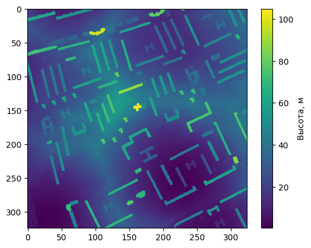
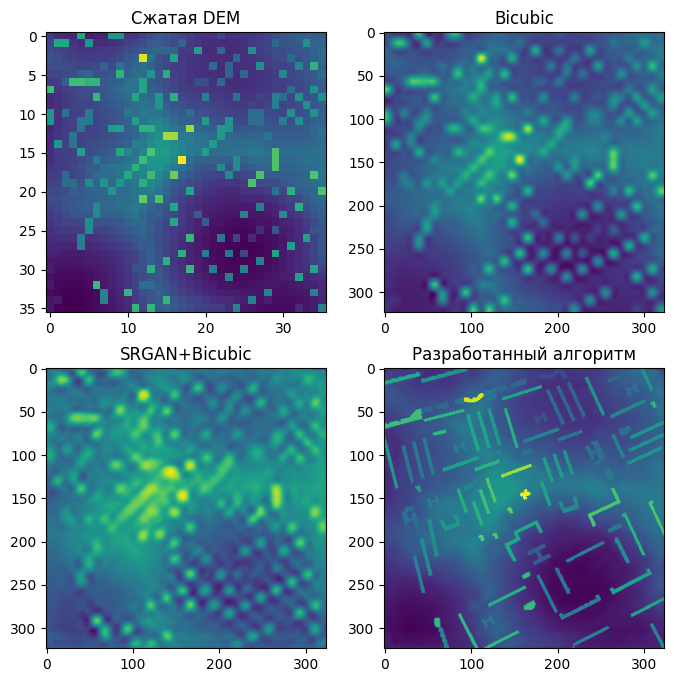

# City-DEM-Superresolution

В этом репозитории представлен исходный код и текст моей магистерской ВКР на тему "Разработка алгоритма генерации ландшафта по неполным данным для увеличения разрешения карт высот городской застройки"

Разработанный метод увеличения картвысот городской засртойки заключает в удалении зданий с карт высот, последующей интерполяции удалённых точек, увеличении разрешения при помощи обученной SRGAN и восстановлении точек зданий на основе высот исходной карты.

В качестве масок зданий использовались датасет [WSF-2019](https://download.geoservice.dlr.de/WSF2019/#download) и [OSM](https://www.openstreetmap.org/#map=13/59.9417/30.2763&layers=H). Исхоными данными были карты [GLO-30](https://portal.opentopography.org/raster?opentopoID=OTSDEM.032021.4326.3) и [3DEP](https://data.usgs.gov/datacatalog/data/USGS:77ae0551-c61e-4979-aedd-d797abdcde0e) с горизонтальной точностью в 30м и 1м соответственно. На их основе был сделан датасет с тайлами размером в 0.01 градуса в районе Вашингтона можно найти в [архиве](https://disk.yandex.ru/d/bRiIXlhDrGrrMQ) на ЯндексДиске факультета Школы Разработки Видеоигр Университета ИТМО.

# Результат работы алгоритма

С помощью эталонной карты высот (рисунок 1), полученной при помощи процедурной генерации, была произведена проверка и оценка работы алгоритма. На рисунке 2 приведены исходная карта высот, карта высот с уменьшенной точностью и карты высот, полученные из неё тремя методами:

- Классическим методом бикубической интерполяции (Bicubic), с которым часто производят сравнения;
- Разработанный алгоритм без шагов удаления и восстановления зданий, то есть метод для увеличения карт высот природного ландшафта (SRGAN + бикубическая интерполяция);
- Разработанный алгоритм.

*Рисунок 1 - Эталонная карта высот городской застройки*

*Рисунок 2 - Результаты работы алгоритмов по увеличению карты высоты городской застройки*

Также были вычислены среднеквадратическая ошибка (MSE) и пиковое отношение сигнала к шуму (PSNR) нормализованных значений карт, приведённые в таблице 1.

*Таблица 1*

| Метод интерполяции      | MSE         | PSNR, дБ   |
|-------------------------|-------------|------------|
| Бикубическая            | 0,013144    | 18,812723  |
| SRGAN + Бикубическая    | 0,044859    | 13,481476  |
| Разработанный алгоритм  | 0,004231    | 23,735850  |

На основе приведённых вычислений видно, что разработанный метод увеличения разрешения карт высот городской застройки имеет наименьшую среднеквадратическую ошибку и наибольшее пиковое отношение сигнала к шуму. Из этого можно сделать вывод, что алгоритм справляется с поставленной задачей лучше классического метода бикубической интерполяции и метода для увеличения разрешения DEM природного ландшафта. Стоит заметить, что алгоритм, обученный на природном ландшафте, справился хуже, чем бикубическая интерполяция. Это также показывает, что карты высот городского ландшафта сильно отличаются от карт высот природного ландшафта, поэтому при исследовании и разработке алгоритмов необходимо обучать и проверять их на одном и том же типе карт.

# Повторение результатов и использование алгоритма

## Получение датасета из исходных данных

## Обучение SRGAN

## Проверка на эталонной карте

## Использование на данных из датасета